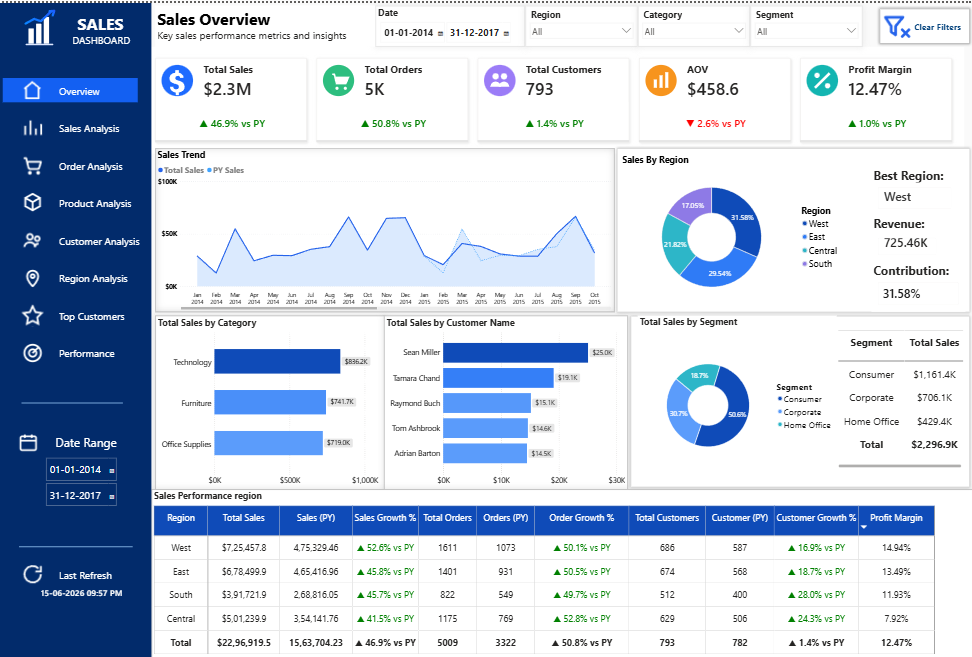

# 📊 Amazon Sales Dashboard | Power BI

## Dashboard Preview



---

# 📌 Project Overview

The **Amazon Sales Dashboard** is an interactive Power BI report designed to analyze sales performance, customer behavior, product performance, and regional trends. The dashboard enables business users to monitor key performance indicators (KPIs), compare year-over-year performance, and make data-driven decisions.

**Reporting Period:** January 2014 – December 2017

---

# 🎯 Business Objective

The objective of this dashboard is to:

- Monitor overall sales performance.
- Track year-over-year (YoY) business growth.
- Analyze regional sales distribution.
- Identify top-performing product categories.
- Understand customer purchasing behavior.
- Evaluate sales performance across market segments.
- Support business decisions using interactive visualizations.

---

# 🛠 Tools & Technologies

- Power BI Desktop
- Power Query
- DAX
- SQL
- Microsoft Excel
- Data Modeling

---

# 📌 Key Performance Indicators (KPIs)

| KPI | Value |
|------|-------:|
| Total Sales | $2.3M |
| Total Orders | 5K |
| Total Customers | 793 |
| Average Order Value | $458.6 |
| Profit Margin | 12.47% |

---

# 📊 Dashboard Features

### Executive Overview

Provides a high-level summary of overall business performance.

### Sales Trend Analysis

- Monthly Sales Trend
- Previous Year Sales Comparison
- Year-over-Year Growth

### Regional Analysis

- Sales by Region
- Best Performing Region
- Regional Contribution

### Product Analysis

- Sales by Category
- Product Performance Comparison

### Customer Analysis

- Top Customers
- Customer Contribution
- Customer Growth

### Segment Analysis

- Consumer Segment
- Corporate Segment
- Home Office Segment

### Performance Summary

A detailed matrix displaying:

- Sales
- Orders
- Customers
- Growth %
- Profit Margin

---

# 📷 Dashboard Screenshot


---

# 🔍 Business Insights

## 1. Strong Overall Business Performance

- Total sales reached **$2.3 Million** across more than **5,000 orders**.
- The business serves **793 unique customers**, indicating a broad customer base.

---

## 2. West Region Leads Sales

- The **West region** generated the highest revenue.
- Revenue exceeded **$725K**.
- It contributes approximately **31.58%** of total sales.

**Recommendation**

Increase inventory and marketing investments in the West region to maximize revenue.

---

## 3. Technology is the Best Performing Category

Technology contributes the highest sales among all product categories.

**Recommendation**

Increase promotional campaigns for Technology products to drive additional revenue.

---

## 4. Consumer Segment Generates Highest Revenue

The Consumer segment contributes over **50%** of total sales.

**Recommendation**

Focus customer loyalty programs on Consumer customers to improve repeat purchases.

---

## 5. Sales Show Positive Year-over-Year Growth

Compared to the previous year:

- Sales increased by **46.9%**
- Orders increased by **50.8%**
- Customers increased by **1.4%**

The business continues to expand steadily.

---

## 6. Average Order Value Slightly Declined

Average Order Value decreased by **2.6%** compared to the previous year.

**Recommendation**

Introduce product bundles and upselling strategies to increase basket size.

---

## 7. Healthy Profit Margin

Profit Margin remains at **12.47%**, showing consistent profitability.

---

## 8. Customer Base Continues to Grow

Customer growth remains positive while maintaining strong sales performance.

---

## 9. Monthly Sales Trend

Sales fluctuate throughout the year with peak performance during several high-demand months.

Seasonal trends should be considered for inventory planning.

---

## 10. Regional Performance Comparison

Regional analysis highlights differences in revenue contribution, customer growth, and profit margin, helping management prioritize investments.

---

# 💡 Recommendations

- Increase investment in high-performing regions.
- Expand Technology product offerings.
- Improve Average Order Value through cross-selling.
- Strengthen customer retention strategies.
- Monitor underperforming regions.
- Continue tracking KPIs using Power BI.

---

# 💾 SQL Queries Used

The project includes SQL scripts for:

- Data Extraction
- Sales Analysis
- Customer Analysis
- Product Analysis
- Regional Analysis

---

# 📂 Repository Structure

```text
Amazon-Sales-Dashboard-PowerBI
│
├── README.md
│
├── pbix
│   └── Amazon_Sales_Dashboard.pbix
│
├── screenshots
│   └── Amazon_Sales_Dashboard.png
│
├── data
│   └── Amazon_Sales_Data.xlsx
│
├── sql-queries
│   ├── Sql_queries.sql
│
├── dax-measures
│   └── DAX_Measures.md
│
└── documentation
    └── Amazon_Sales_Dashboard_Project_Documentation.pdf
```

---

# 🚀 Skills Demonstrated

- Power BI Dashboard Development
- Data Modeling
- Power Query
- DAX Calculations
- SQL Query Writing
- Business Intelligence
- KPI Reporting
- Data Visualization
- Sales Analytics
- Customer Analytics
- Financial Reporting

---

# 📈 Business Value

This dashboard enables decision-makers to:

- Monitor sales performance
- Improve profitability
- Identify high-performing regions
- Optimize product strategy
- Enhance customer retention
- Support strategic business planning

---

# 👤 Author

**Bhavani B R**

**Power BI Developer | Data Analyst**

- GitHub: https://github.com/BhavaniAshik
- LinkedIn: https://www.linkedin.com/in/bhavani-b-r-/
